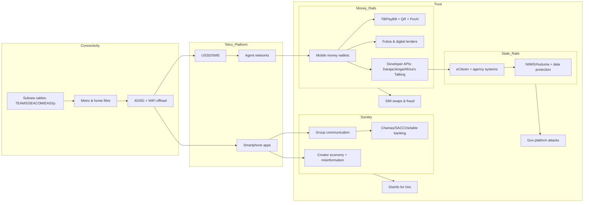
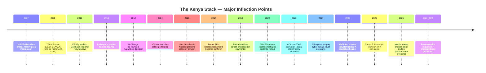

# The Kenya Stack: Rails, Hustle, and the Republic of Builders — Research Brief & Drafting Bible

## Executive summary

In Kenya, “the stack” is not a metaphor; it is a lived set of rails that ordinary people climb every day: connectivity that *works on cheap phones*, identity that *sometimes works and sometimes excludes*, money that *moves instantly*, and a state that is learning—unevenly—to become software. The country’s technology story coheres because the rails reinforce each other: submarine cables lower bandwidth costs and enable apps; telcos turn that access into distribution; mobile money turns distribution into a marketplace; and APIs turn that marketplace into an ecosystem. That chain reaction is visible in the arc from early mobile money to today’s developer platforms and fintech “super-app” strategies, including new services that let retail users buy shares on the stock exchange through the mobile money interface.

The book should treat “rails” as characters. Each rail has a personality: the *fibre* rail is quiet, slow, infrastructural; the *telco* rail is competitive, political, and distribution-obsessed; the *money* rail is obsessive about trust and uptime; the *state* rail swings between efficiency and surveillance; the *social* rail (WhatsApp groups, TikTok feeds, “KOT” pile-ons) moves faster than any regulator. Kenya’s most important innovation is not a single startup—it is the way these rails fused into a national habit of *building on top of what exists*, often with improvisation (agents, USSD menus, informal commerce workflows) rather than replacement.

That fusion has a shadow. Trust has a “dark twin”: SIM swaps, mobile money fraud, cyberattacks on government systems, and a harassment-for-hire economy that weaponizes social platforms. Kenya’s cybersecurity story must be written as part of the same stack—not a side plot—because the nation’s adoption curve creates a larger attack surface, and because every fraud incident is a tax on belief.

The future chapter (2026–2045) should argue that Kenya is entering an era of “programmable regulation”: digital credit licensing, data protection enforcement, virtual asset regulation, e-mobility standards, and platform-worker disputes are becoming as central to innovation as code. Kenya’s newly formalized virtual asset framework (law and policy) offers a clean narrative hinge: the country that once “exported” mobile money as an idea is now forced to regulate the next wave—stablecoins, tokenized assets, and API-native finance—while protecting consumers without killing experimentation.

## Story architecture and narrative rules

The book will read like a national epic told through intimate scenes: a developer watching a payment callback finally succeed at 2 a.m.; a mama mboga reconciling a PayBill statement; a SACCO treasurer arguing with members in a WhatsApp group; a data annotator describing what “AI” cost them; a regulator drafting rules that must survive both politics and the market.

Use a consistent triad in every chapter/episode:

**Builder**: the person who lays a rail or builds on it (engineer, founder, product manager, government technocrat, community organizer).
**User**: the person whose life is reorganized by the rail (merchant, rider, farmer, student, diaspora worker, content creator).
**Referee**: the person or institution that legitimizes, constrains, taxes, licenses, audits, or bans (regulator, court, ministry, telco compliance unit, platform trust-and-safety team).

Write each chapter as a *collision* between the three. The rail is the arena; the protagonists are the fighters; the reader learns the system by watching people try to use it under pressure.

Narrative rules (drafting bible):

1. **Cold open = sensory scene + a single decision.** Start with a moment where someone must choose (ship captain, agent, coder, minister, driver, moderator). Stay in scene for 2–3 pages before explanation.
2. **Explain the rail only after it matters.** Teach the system when a character hits friction (integration delays, a reversal that fails, a SIM swap that empties a wallet, a DDoS that shuts the state).
3. **Prefer “workflows” over “features.”** The Kenyan stack is not apps; it is routines (cash-in/cash-out, group saving, till reconciliation, school fee payment, remittance).
4. **Make the informal economy the default.** Formal institutions appear as constraints or accelerants—never the main stage.
5. **Use WhatsApp as connective tissue.** In Kenya, WhatsApp is not just messaging; it is governance, commerce, community finance, and rumor distribution. Treat it as a “social operating system.”
6. **Respect harm.** Fraud and disinformation are real injuries; don’t glamorize tactics or provide “how-to.” Focus on incentives, impacts, and safeguards.

## Cast appendix and systems map

### Cast appendix table

The table below is the *profile spine*—who to center, what they built, and where to start reading. Any name marked **Verify** needs confirmation before publishing.

| Company / Project / Institution | One-line description | Key people to profile | Source links |
|---|---|---|---|
| Communications Authority of Kenya | Telecom regulator; hosts national KE-CIRT/CC and publishes sector/cyber reports | David Mugonyi; cybersecurity team leads (Verify) | |
| Central Bank of Kenya | Licenses/oversees digital credit providers; key actor in fintech regulation | Kamau Thugge; DCP licensing unit (Verify) | |
| Office of the Data Protection Commissioner | Enforces data protection; central to identity, lending, platform governance | Immaculate Kassait | |
| Safaricom | Dominant telco; runs the country’s most important money + API rails | Peter Ndegwa; Michael Joseph; Bob Collymore | |
| M-PESA | Mobile money platform: payments, merchant rails, credit, APIs | Nick Hughes; product/agent ops leaders (Verify) | |
| Vodafone | Co-originator of early M-PESA model; expansion attempts | Nick Hughes; global mobile money strategists (Verify) | |
| Daraja | M-PESA/Safaricom developer platform; API bridge + mini-app ecosystem | developer relations leads (Verify); ecosystem builders | |
| Africa's Talking | SMS/USSD/Voice/Airtime APIs powering startups and enterprises | Samuel Gikandi; Eston Kimani | |
| Finserve Africa | Equity’s fintech arm; Jenga gateway + APIs | Jack Ngare (Verify title); Equity ecosystem execs (Verify) | |
| Jenga | Payments + bank rails APIs (mobile wallets, bank transfers, cards) | API product leadership (Verify) | |
| SASRA | Regulates SACCO sector; sets integrator requirements | policy leads (Verify) | |
| Stanbic Bank Kenya | Bank building “Chama App” digitization layer | chama product team (Verify) | |
| M-Changa | Mobile/online fundraising (“harambee” digitized) | Kyai Mullei; David Mark | |
| Eneza Education | SMS-based learning + exam prep for low-connectivity contexts | Kago Kagichiri (Verify); founders (Verify) | |
| BRCK | Connectivity hardware; Moja public WiFi; education kits | Nivi Mukherjee (Verify); BRCK founders (Verify) | |
| Moja WiFi | Monetized public WiFi that feels “free” to users | ops leads (Verify); transport partners (Verify) | |
| eLimu | Digitized Kenyan primary curriculum; learning content | Nivi Sharma; Marie Githinji | |
| Kenya Institute of Curriculum Development | Curriculum authority; sets learning standards | curriculum leaders (Verify) | |
| Moringa School | Coding school; talent pipeline into startups and corporates | Audrey Cheng | |
| Andela | Talent pipeline + global hiring; African dev story | Iyinoluwa Aboyeji; Jeremy Johnson | |
| Twiga Foods | B2B supply chain platform linking farmers to vendors | Peter Njonjo; Grant Brooke (Verify) | |
| Sendy | On-demand logistics; boom-to-shutdown cautionary tale | Meshack Alloys | |
| Lori Systems | Freight logistics marketplace & digitized operations | Josh Sandler; Jean-Claude Homawoo; Ernest Gichini Ngaruiya (Verify spelling) | |
| Tala | App-based credit; now regulated; CRB interfaces | Shivani Siroya | |
| Branch | App-based credit; credit scoring and distribution | Matt Flannery; Daniel Jung (Verify role) | |
| Fuliza | Micro-overdraft embedded into payments | bank partners (Verify); product leads (Verify) | |
| M-KOPA | PAYGo financing for solar/smartphones | founders (Verify details); CEO Jesse Moore | |
| d.light | PAYGo solar systems | Ned Tozun; Sam Goldman | |
| Sun King | Solar products + PAYGo financing (formerly Greenlight Planet) | founders (Verify) | |
| Watu | Asset finance (esp. motorbikes); controversy and politics | Andris Kaneps | |
| Roam | Electric motorcycles/buses built for African conditions | Filip Lovstrom; Mikael Gånge; Albin Wilson | |
| WeFarm | SMS farmer knowledge network | Kenny Ewan | |
| Apollo Agriculture | Inputs + advice + credit for farmers | Eli Pollak; Benjamin Njenga; Earl St Sauver | |
| One Acre Fund | Inputs + training + finance for smallholders | Andrew Youn; John Gachunga | |
| GiveDirectly | Direct cash transfers; evidence-heavy aid model | Paul Niehaus; Michael Faye; Rohit Wanchoo | |
| Ajira Digital | Government-led digital work program; gig economy pipeline | programme managers (Verify) | |
| Sama | AI data labeling; content moderation controversies | Daniel Motaung (Verify); worker advocates (Verify) | |
| Parliament of Kenya | Passes laws shaping new rails (VASP, cyber, etc.) | Kuria Kimani (Verify) | |

### Systems map diagrams

## Episode cards

Below are compact “episode cards” for drafting. Each includes a cold open, the rail, protagonist archetypes, beats, priority sources, and interview targets. (Names referenced are in the Cast Appendix; mark **Verify** where needed.)

**Episode 1 — The Cable on the Beach**
Cold open: Dawn in Mombasa—workers pull a fibre cable inland while politicians talk about “historic proportions” and a technician worries about a single bend radius.
Rail defined: Subsea + terrestrial fibre as the base layer of every upper rail.
Protagonists: Builder (Bitange Ndemo / cable engineers); User (cybercafé owner / student); Referee (telecom ministry + regulator).
Beats: (1) Pre-2009 bandwidth scarcity shapes early internet culture. (2) TEAMS/SEACOM landings drop prices and enable always-on connectivity. (3) EASSy completes redundancy and regional links. (4) The “invisible” rail becomes visible during outages when traffic reroutes. (5) Fibre enables the next wave: BPO dreams, startup hubs, streaming, and cloud dependency. (6) The new national vulnerability: cable cuts and regional faults become geopolitical events.
Primary sources: ITU on EASSy landing ; SEACOM cable history/landing details ; RTI study on Kenya subsea cable impacts (for data/graphs) .
Interview targets: Bitange Ndemo (policy memory); SEACOM Kenya/landing station ops (Verify); ISP network engineer who handled a major outage.

**Episode 2 — Telco Wars at the Tower**
Cold open: A field engineer climbs a rural mast; below, a shopkeeper asks why the “network is down again” while a rival’s SIM suddenly works.
Rail defined: Mobile coverage + tower economics + spectrum allocation.
Protagonists: Builder (telco radio engineers); User (rural trader, matatu crew); Referee (CAK spectrum/licensing).
Beats: (1) Competition drives rollout beyond affluent urban cores. (2) Tower economics rewards density; rural coverage needs policy pressure and creative capex. (3) Network-sharing becomes strategy across Africa, reshaping cost structures. (4) Service quality becomes political: outages as public scandals. (5) Mobile becomes the default internet—setting the stage for USSD-first product design.
Primary sources: CAK sector/cyber context ; Reuters on regional connectivity disruptions and redundancy ; Safaricom fibre/network explainers (context) .
Interview targets: CAK spectrum directorate (Verify); telco network planning lead (Verify); rural small-business owner on uptime costs.

**Episode 3 — Zuku and the Broadband Home**
Cold open: A family negotiates the month’s budget—data bundles vs a home fibre plan—while kids stream and parents pray the WiFi won’t stall homework.
Rail defined: Fixed broadband ISPs + last-mile fibre/coax + “triple play” economics.
Protagonists: Builder (ISP product/infra teams); User (household, landlord); Referee (CAK consumer protection).
Beats: (1) Home internet changes consumption: YouTube, remote work, online school. (2) ISPs compete on price, installation friction, reliability. (3) Bundling (TV + internet) becomes a growth hack. (4) Insolvency and supplier disputes show the capex fragility of last-mile networks. (5) Fibre becomes the quiet competitor to mobile data—and a pressure valve during mobile congestion.
Primary sources: Zuku official offerings ; Safaricom Home Fibre launch/terms timeline ; Business Daily on Zuku insolvency risk (industry stress signal) .
Interview targets: Wananchi/Zuku exec (Verify); Safaricom Home Fibre rollout manager (Verify); household user in a mixed-income estate.

**Episode 4 — The Cheap Smartphone Republic**
Cold open: A phone seller at a downtown stall flashes five Android models and three “refurbished” iPhones; the customer asks only one question: “Inaweza M-PESA?”
Rail defined: Device affordability + Android ecosystem + informal distribution.
Protagonists: Builder (device assemblers/importers); User (first-time smartphone owner); Referee (standards authority/consumer protection).
Beats: (1) Smartphones turn USSD rails into app rails without replacing old habits. (2) Informal markets compress price; quality varies; repairs become part of the stack. (3) Apps localize: Swahili, lite versions, offline-first flows. (4) Fraud adapts: counterfeit apps, phishing links, account takeovers. (5) A “phone” becomes a bank branch, classroom, and studio.
Primary sources: CAK device/social stats context ; CAK cyber threat environment ; Serianu mobile fraud context .
Interview targets: Nairobi phone market trader (Verify); mobile security researcher; youth first-time smartphone user.

**Episode 5 — Agent Nation**
Cold open: An agent counts cash twice, checks the float balance, and tells a customer, “Nitarudia, network iko slow.”
Rail defined: Cash-in/cash-out agent networks as the bridge between cash economy and digital money.
Protagonists: Builder (agent network operations); User (daily wage worker); Referee (CBK/AML compliance).
Beats: (1) The agent is the “physical UI” of digital finance. (2) Float constraints create micro-liquidity markets. (3) Trust is local and relational; the agent’s reputation substitutes for formal banking reputation. (4) Agent density becomes defensibility for mobile money leaders. (5) Fraud pressure shifts onto agents: impersonation, social engineering.
Primary sources: World Bank M-PESA origin and model ; Safaricom business rails overview ; CAK emerging threats including SIM swap fraud .
Interview targets: long-tenured agent in an estate market; Safaricom agent operations manager (Verify); CBK AML supervision (Verify).

**Episode 6 — Launch Day: Mobile Money Becomes Normal**
Cold open: 2007: a first-time user sends money home, then waits, then smiles when the other phone beeps.
Rail defined: Mobile money ledger + USSD interface + agent network.
Protagonists: Builder (early mobile money team); User (migrant worker sending remittance); Referee (telco regulator + banking regulator).
Beats: (1) “Send money” solves a national pain: distance, cash risk, family obligations. (2) Early skepticism gives way to habit as the network effect compounds. (3) The system becomes an economy: fees, float, new businesses. (4) Research shows broad welfare effects—poverty reduction, risk sharing, resilience. (5) The platform becomes a template for Africa’s mobile money boom—even where direct replication fails.
Primary sources: World Bank case study on M-PESA launch and early operations ; NBER paper on long-run impacts ; GSMA on why Kenya-scale network effects are hard to replicate .
Interview targets: early Safaricom/Vodafone M-PESA product staff (Verify); rural remittance recipient; economist who studied adoption.

**Episode 7 — PayBill: The Invoice Becomes a Number**
Cold open: A school bursar writes a PayBill on a noticeboard; parents photograph it like scripture.
Rail defined: C2B bill-pay rails (PayBill) as institutional collections infrastructure.
Protagonists: Builder (product managers for PayBill); User (school parent/SME); Referee (consumer protection + audit).
Beats: (1) PayBill turns payments into accounting objects: reference numbers, statements. (2) Institutions adopt: schools, utilities, churches, landlords. (3) Reconciliation becomes the hidden work; portals and dashboards expand. (4) Fraud follows the number: fake PayBills, social engineering. (5) The rail becomes the backbone for e-commerce checkouts and government fees.
Primary sources: Safaricom PayBill product page ; Lipa na M-PESA overview (PayBill context) ; M-PESA business portal guide (ops/recon layer) .
Interview targets: school bursar; SME using PayBill daily; Safaricom merchant payments lead (Verify).

**Episode 8 — Till Numbers and the Street Merchant**
Cold open: A customer buys vegetables; the seller says “Buy Goods” faster than they say hello.
Rail defined: Merchant till rails + instant payments at point of sale.
Protagonists: Builder (merchant acquiring teams); User (informal merchant); Referee (tax authority / consumer protection).
Beats: (1) Till rails reduce cash handling and theft risk. (2) Informal merchants adopt without paperwork-heavy onboarding. (3) Competition: multiple networks and interoperability posters appear. (4) Merchant tools evolve: statements, role management, float movement. (5) The street becomes legible to finance—sometimes empowering, sometimes extractive.
Primary sources: Safaricom Buy Goods product page ; business till enhancements ; interoperability poster (multi-network payments) .
Interview targets: market trader; merchant aggregator like Kopo Kopo (Verify); KRA SME tax unit (Verify).

**Episode 9 — Pochi: When the Wallet Splits in Two**
Cold open: A small food vendor complains: “Fuliza ilikuwa inakula pesa zangu.” Then a new wallet feature changes the argument.
Rail defined: Sub-wallets for microbusiness separation (personal vs business).
Protagonists: Builder (Pochi product team); User (informal micro-merchant); Referee (financial consumer protection).
Beats: (1) Informal merchants need separation without formal accounts. (2) Pochi reframes business bookkeeping as a feature. (3) It shows how “product design” can move millions faster than policy. (4) It becomes a countermeasure to overdraft deductions in mixed wallets (context to verify per product rules). (5) It signals the shift to “Fintech 2.0” and embedded finance.
Primary sources: Safaricom Pochi product page ; Pochi FAQ ; Safaricom “20 years” press release (SME push) .
Interview targets: micro-merchant user; Safaricom SME product lead (Verify); consumer advocate on fees.

**Episode 10 — Ratiba and Recurring Kenya**
Cold open: A parent sets a standing instruction for rent/school fees, because remembering is expensive.
Rail defined: Standing orders/recurring payments on mobile money.
Protagonists: Builder (payments scheduling team); User (parent/tenant); Referee (bank partners + regulators).
Beats: (1) Automation turns “hustle” into predictable cashflows. (2) Recurring payments make microenterprise more bankable. (3) They also create failure modes: insufficient funds, disputes, reversals, fraud. (4) Recurrence is the bridge to subscription economies. (5) It’s the logic layer for the super-app era.
Primary sources: Safaricom M-PESA services/innovation pages (recurrence context) ; Daraja 3.0 roadmap framing (Fintech 2.0) ; CBK payments/digital finance context .
Interview targets: landlord/property manager; fintech product manager (Verify); CBK payments oversight (Verify).

**Episode 11 — Fuliza: Credit Inside the Payment**
Cold open: A commuter at a petrol station: “Niko short.” The transaction still goes through—the overdraft is invisible.
Rail defined: Overdraft-as-a-feature embedded in transaction completion.
Protagonists: Builder (telco + bank partnership team); User (everyday spender); Referee (CBK + consumer protection).
Beats: (1) Fuliza normalizes microcredit as “continuity,” not borrowing. (2) It alters spending patterns and liquidity planning. (3) It creates systemic fee revenue—and controversy about cost and dependency. (4) It becomes a model for embedded finance and BNPL-like flows. (5) It forces regulators to treat telcos as credit distribution utilities.
Primary sources: Safaricom Fuliza explainer ; Safaricom Fuliza product page ; confirmation of Jan 2019 launch context .
Interview targets: heavy Fuliza user; NCBA/KCB partner team members (Verify); CBK digital credit supervision.

**Episode 12 — Daraja: The Day the Rail Opened**
Cold open: 2017: a developer hits “Create App,” gets keys, and realizes they can finally ship payments without a telco meeting.
Rail defined: Externalized APIs that turn internal rails into a platform economy.
Protagonists: Builder (developer platform team); User (startup founder); Referee (security/compliance).
Beats: (1) Daraja launches as a portal for M-PESA APIs (Aug 2017). (2) It compresses integration timelines and lowers gatekeeping. (3) It changes what counts as a Kenyan startup: payments become assumed. (4) Security hardens as adoption grows; incident response becomes part of product. (5) Daraja 3.0 reframes the platform as “Fintech 2.0” and a mini-app ecosystem.
Primary sources: Safaricom annual report noting 2017 release ; 2021 press release on simplifying access ; Daraja 3.0 launch press release .
Interview targets: Safaricom developer relations lead (Verify); SME integrator; security engineer handling API abuse.

**Episode 13 — Africa’s Talking: The SMS/USSD Switchboard**
Cold open: A two-person startup can’t afford telco integrations; they buy an API key and suddenly can reach customers on any phone.
Rail defined: Communications APIs as the “messaging rail” under fintech, logistics, and edtech.
Protagonists: Builder (Africa’s Talking platform team); User (startup building USSD); Referee (telco partners + regulator).
Beats: (1) Unified APIs simplify fragmentation across operators and countries. (2) USSD remains essential for low-connectivity and low-smartphone segments. (3) Messaging becomes product distribution, not marketing. (4) The platform becomes invisible infrastructure for thousands of services. (5) It complements M-PESA: money needs messages (STK prompts, OTPs, receipts).
Primary sources: Africa’s Talking official platform description ; developer documentation ; IFC disclosure (ownership/structure) .
Interview targets: Samuel Gikandi; a startup using USSD for onboarding; telco wholesale/API partnership lead (Verify).

**Episode 14 — Jenga: Banking as an API**
Cold open: A fintech founder says, “We don’t need a bank license—we need a bank endpoint.”
Rail defined: Banking-as-a-service: transfers, KYC querying, payment gateways as modular services.
Protagonists: Builder (Finserve/Jenga team); User (SME/fintech); Referee (CBK + cross-border compliance).
Beats: (1) Finserve launches Jenga Payment Gateway plus Jenga APIs in a developer-facing event. (2) The gateway aggregates fragmented payment methods. (3) APIs promise KYC/AML/CRB tools as endpoints—raising privacy and governance stakes. (4) Cross-border ambitions collide with compliance realities. (5) BaaS becomes the second platform layer after telco APIs—banking without branches.
Primary sources: Finserve launch press release (Jenga gateway + APIs) ; Jenga site overview ; Jenga API docs .
Interview targets: Finserve leadership (Verify); compliance officer; developer integrating Jenga for payouts.

**Episode 15 — Merchant Rails Beyond the Telco**
Cold open: A merchant wants card, wallet, and bank in one checkout; the aggregator promises “one integration.”
Rail defined: PSPs, aggregators, and merchant acquiring (cards + wallets + bank).
Protagonists: Builder (PSPs); User (merchant); Referee (CBK licensing).
Beats: (1) Mobile money dominance creates space for payment orchestration startups. (2) Banks enter via strategic stakes and partnerships, competing with telco rails. (3) Merchant credit and inventory tools emerge bundled with payments. (4) Consolidation signals maturity. (5) The struggle is trust: chargebacks, fraud, reconciliation.
Primary sources: Pesapal origin/story ; DPO growth/acquisition context ; CGAP on aggregators (market mechanics) .
Interview targets: merchant using multiple rails; PSP compliance head; bank digital payments head.

**Episode 16 — eCitizen: The State Learns a Login**
Cold open: A citizen renews a license online; the queue disappears, replaced by a browser spinner.
Rail defined: Digital government service portal as a national workflow layer.
Protagonists: Builder (ICT Authority + agency IT teams); User (citizen); Referee (auditors, procurement, courts).
Beats: (1) eCitizen launches as gateway to government services (2014). (2) It expands to thousands of services—payments become default. (3) It reorganizes bureaucracy: fees become digital, receipts standardized. (4) It creates new chokepoints: authentication, outages, integration debt. (5) It becomes a national target for cyberattacks—statehood as uptime.
Primary sources: eCitizen “about” / launch info ; reporting on 2023 eCitizen attack affecting 5,000+ services ; Carnegie analysis on Kenya’s digital superhighway vulnerabilities .
Interview targets: government digital service architect (Verify); citizen who relies on eCitizen monthly; cybersecurity responder.

**Episode 17 — Identity: Huduma, NIIMS, and the People the System Forgets**
Cold open: Registration line—biometrics, paperwork, and a quiet fear: “What if I’m locked out of services?”
Rail defined: National digital identity programs and integrated registries.
Protagonists: Builder (Interior ministry/registry teams); User (marginalized communities); Referee (courts + ODPC).
Beats: (1) NIIMS/Huduma Namba aims to unify identity across services. (2) Civil society challenges highlight discrimination risk and data governance gaps. (3) Courts shape implementation limits and sequencing with data protection. (4) ODPC emerges as a critical “referee” for digital state legitimacy. (5) Identity becomes a prerequisite rail for fintech KYC and e-gov access—raising stakes.
Primary sources: Kenya Law case record (Huduma/NIIMS litigation) ; ODPC guidelines/NIIMS regulations index ; Justice Initiative overview of NIIMS case constraints .
Interview targets: ODPC official; affected community advocate; government registry engineer.

**Episode 18 — Cyberattack Week: When the State Goes Offline**
Cold open: July 2023—passport applicants refresh a broken portal; airlines scramble; a minister says “no data lost.”
Rail defined: Government platforms as critical infrastructure; DDoS and resilience.
Protagonists: Builder (state IT + telco redundancy teams); User (traveler / business owner); Referee (national security + cyber coordination).
Beats: (1) eCitizen disruption paralyzes access to major services. (2) Attack claims (Anonymous Sudan) become part of the story—identity of attackers is contested. (3) Public trust shifts: digital convenience vs fear of fragility. (4) Government response reveals incident playbooks and interagency coordination. (5) The event becomes a cautionary tale for digitization without resilience investment.
Primary sources: Citizen Digital on attack scope ; Business Daily description of DDoS mechanics ; CAK KE-CIRT/CC threat awareness framing .
Interview targets: KE-CIRT/CC responder (Verify); passport applicant affected; independent Kenyan security researcher.

**Episode 19 — Kenya’s High-Profile Hacks Hall of Fame**
Cold open: A public agency issues a statement: “No sensitive data leaked”—the phrase that always arrives after the damage.
Rail defined: Institutional cybersecurity and crisis communications.
Protagonists: Builder (security teams); User (public); Referee (ODPC, investigators, courts).
Beats: (1) KAA confirms a breach attributed to Medusa ransomware (April 2023). (2) Business registry systems face breach alerts and investigations. (3) Public-facing accounts (KRA on X) get compromised, creating fraud windows. (4) Each incident reveals the stack’s dependency on identity + trust. (5) The pattern: response capacity improves, but attackers scale faster.
Primary sources: KAA breach confirmation ; Registrar/BRS breach alert reporting ; KRA X compromise confirmation .
Interview targets: former KAA IT/security staff (Verify); BRS officials (Verify); ODPC breach response unit.

**Episode 20 — SIM Swaps: Trust’s Dark Twin**
Cold open: A user wakes to “You have withdrawn…” alerts. The SIM is theirs; the number is not.
Rail defined: SIM registration, mobile identity, and account takeover risk.
Protagonists: Builder (telco security); User (fraud victim); Referee (CAK + police + banks).
Beats: (1) SIM swap fraud persists as a high-impact vector. (2) Social engineering often beats technical controls. (3) KYC hardening raises criminal innovation. (4) Fraud becomes a tax on digital inclusion; victims revert to cash. (5) The ecosystem evolves countermeasures: MFA, better reporting, device binding—but usability tension remains.
Primary sources: CAK cyber report naming SIM swap fraud as an emerging threat ; Serianu loss scenarios including SIM swap/mobile money fraud ; Computer Misuse and Cybercrimes Act (legal backdrop) .
Interview targets: fraud victim (anonymous); CAK cyber unit; telco fraud investigations lead (Verify).

**Episode 21 — SACCOs: Kenya’s Parallel Banking System**
Cold open: A teacher’s SACCO meeting—minutes, contributions, loans—then someone asks, “Tunaweka hii kwa app?”
Rail defined: Cooperative finance infrastructure and digitization.
Protagonists: Builder (SACCO core banking vendors); User (member/borrower); Referee (SASRA).
Beats: (1) SACCOs serve as parallel financial rails—savings, loans, community trust. (2) Digitization pressures: mobile access, instant disbursement, consumer expectations. (3) Integrators become power brokers; regulators respond with requirements. (4) Remittances and diaspora products move into SACCO conversations. (5) Digitization risks: fraud, governance disputes, platform lock-in.
Primary sources: SASRA integrator requirements portal ; Treasury policy noting SASRA in VASP/VA regulatory ecosystem ; CBK fintech supervision context .
Interview targets: SASRA policy head (Verify); SACCO CIO; member whose life runs on SACCO loans.

**Episode 22 — Chamas: Where Finance Is a Group Chat**
Cold open: WhatsApp group: “Contribution reminder.” Another message: “Penalty for lateness.” Someone reacts with an emoji war.
Rail defined: Informal group finance + social enforcement + digitization apps.
Protagonists: Builder (chama digitization products); User (treasurer/member); Referee (banks + consumer protection).
Beats: (1) Chamas and merry-go-rounds are pre-digital rails. (2) Digitization changes transparency and conflict: ledgers become visible. (3) Banks ship “chama apps” to capture this behavior. (4) WhatsApp remains the governance layer even when money is digitized. (5) The cultural logic: trust is social first, financial second.
Primary sources: Stanbic Chama App features and onboarding ; CAK showing WhatsApp dominance in Kenya ; Bank e-chama product example .
Interview targets: chama treasurer; bank product manager; sociologist/anthropologist of money (Verify).

**Episode 23 — Table Banking and Women’s Capital**
Cold open: Women sit around a table; cash and notebooks become a community credit engine.
Rail defined: Table banking as grassroots finance.
Protagonists: Builder (community organizers); User (women entrepreneurs); Referee (policy + NGOs).
Beats: (1) Table banking pools savings into collateral-free credit. (2) It grows through social discipline and shared goals. (3) Digitization offers scaling but risks external capture. (4) The model explains why Kenya adopts group-led fintech quickly. (5) The rail links to development programs and political patronage risks.
Primary sources: Joyful Women Organization description ; academic/NGO studies (table banking) ; CAK WhatsApp/social rail context .
Interview targets: table banking group leader; beneficiary entrepreneur; researcher on women’s finance.

**Episode 24 — M-Changa and Digital Harambee**
Cold open: A fundraising link spreads in family WhatsApp; donors demand receipts; someone asks, “Hii ni legit?”
Rail defined: Crowdfunding + mobile money integration.
Protagonists: Builder (M-Changa team); User (family committee member); Referee (platform trust + AML).
Beats: (1) Harambee culture meets platform accountability. (2) Digitization reduces leakage and speeds collection. (3) It also introduces new fraud types: fake fundraisers. (4) Platforms become “trust brokers” and must provide auditability. (5) Fundraising becomes a micro-insurance mechanism in crises.
Primary sources: M-Changa founding story ; M-Changa platform overview ; Kellogg Insight case context .
Interview targets: Kyai Mullei; frequent donor; fundraiser organizer who migrated from cash to digital.

**Episode 25 — Digital Lending Boom and the Licenses Arrive**
Cold open: A borrower gets a loan in minutes; later, debt collectors text relatives; the state finally drafts rules.
Rail defined: App-based credit scoring + instant disbursement.
Protagonists: Builder (digital lenders); User (borrower); Referee (CBK licensing).
Beats: (1) Lending apps exploit distribution and data from mobile ecosystems. (2) Predatory practices trigger public backlash. (3) CBK introduces DCP regulations for licensing and oversight. (4) ODPC issues guidance, tying lending to data governance. (5) Licensing reshapes the sector: consolidation, compliance costs, fewer “rogue” lenders.
Primary sources: CBK DCP regulations notice ; Kenya Law version of regulations ; ODPC guidance note for digital lenders .
Interview targets: CBK DCP licensing team (Verify); former borrower harmed by collections; founder of a licensed lender.

**Episode 26 — Tala: Credit, Scores, and the Phone as Bank**
Cold open: A phone notification: “Loan approved.” Relief, then the countdown of repayment.
Rail defined: Data-driven underwriting and repayment rails.
Protagonists: Builder (Tala team); User (small trader); Referee (CRB + CBK).
Beats: (1) Tala’s model: small loans, fast turnaround, smartphone data. (2) Credit reporting becomes contentious; borrowers learn CRB language. (3) Regulation forces more transparency and consumer protection. (4) The product shifts from “loan” to “financial identity.” (5) The ecosystem lesson: inclusion can still be extractive.
Primary sources: Tala leadership/about ; Tala CRB FAQ explicitly referencing regulation ; CBK DCP framework .
Interview targets: Shivani Siroya (or Kenya MD, Verify); trader borrower; CRB representative (Verify).

**Episode 27 — Branch: The Bank in Your Pocket**
Cold open: A borrower downloads an app and becomes “banked” without a branch visit.
Rail defined: Credit + scoring + app engagement loops.
Protagonists: Builder (Branch founders); User (gig worker); Referee (CBK/consumer protection).
Beats: (1) Branch uses mobile data as underwriting signals. (2) It scales via referral and app retention. (3) It becomes part of the “loan stack” alongside mobile overdrafts. (4) Regulation professionalizes the model, raising compliance costs. (5) Kenya becomes a laboratory for global microlending playbooks.
Primary sources: Branch leadership page ; early profile/interview context ; CBK DCP regulations .
Interview targets: Matt Flannery (or Kenya head, Verify); borrower with multiple loan apps; CBK examiner (Verify).

**Episode 28 — Twiga: Supply Chain Meets the Mama Mboga**
Cold open: A vendor orders stock by phone; a delivery arrives; price volatility becomes a dashboard metric.
Rail defined: B2B commerce platforms over informal retail.
Protagonists: Builder (Twiga ops + tech); User (vendor/farmer); Referee (food safety + competition).
Beats: (1) Twiga aggregates demand and organizes logistics. (2) It formalizes informal trade without destroying it. (3) It depends on payments, logistics, and trust rails. (4) When funding cycles tighten, unit economics matter. (5) The deeper story: informal retail is Kenya’s real “platform.”
Primary sources: IFC profile on Twiga founding story ; WEF Twiga leadership bio ; mobile money rails context .
Interview targets: Peter Njonjo; vendor customer; warehouse/delivery supervisor (Verify).

**Episode 29 — Sendy: The Logistics Dream and Its Limits**
Cold open: A rider waits for orders that don’t come; the app’s promises shrink; then the shutdown headlines arrive.
Rail defined: On-demand logistics platforms + trust + fleet economics.
Protagonists: Builder (Sendy founders); User (rider/SME); Referee (investors + markets).
Beats: (1) Logistics platforms scale fast in hype cycles. (2) Costs of customer acquisition and fleet management bite. (3) Regional expansion increases complexity. (4) Shutdown becomes a cautionary tale: infrastructure beats apps. (5) Founders recycle into new rails—experience becomes ecosystem capital.
Primary sources: TechCrunch on Sendy shutdown ; profile of founder’s next venture signal ; Kenya’s broader logistics constraints context (market reporting) .
Interview targets: Meshack Alloys; former rider; early investor (Verify).

**Episode 30 — Lori: Digitizing Freight**
Cold open: A truck driver hits a weighbridge; paperwork meets an app; delays become data.
Rail defined: Freight logistics + documentation + payments.
Protagonists: Builder (Lori team); User (transporter/shipper); Referee (transport authorities).
Beats: (1) Freight is high-value but opaque; digitization promises efficiency. (2) Platforms coordinate matching, tracking, documents, and payment. (3) Cross-border freight reveals regulatory fragmentation. (4) Data becomes leverage; platforms become quasi-infrastructure. (5) The rail links directly to export competitiveness.
Primary sources: Lori founding and expansion reporting ; e-mobility/transport policy environment signals ; payments API ecosystems (Jenga/Daraja) .
Interview targets: Lori country ops lead (Verify); truck owner; customs/border agent (Verify).

**Episode 31 — Ride-Hailing: Global Apps, Local Fury**
Cold open: A driver shows a laminated fare chart in the car—an illegal UI layered atop the global app UI.
Rail defined: Platform marketplaces for transport; algorithmic pricing vs local economics.
Protagonists: Builder (ride-hailing product teams/local ops); User (driver); Referee (transport regulators & competition).
Beats: (1) Discounts and price wars create “growth” but squeeze drivers. (2) Drivers strike over commissions; commissions fall under pressure and regulation. (3) Drivers coordinate pricing and resistance via voice apps and informal networks. (4) Convenience erodes when negotiation returns. (5) The episode illustrates a core theme: global rails must localize, or the street rewrites them.
Primary sources: Reuters on drivers defying algorithms ; Business Daily on commission strike ; Business Daily on printed fare lists/illegal extras .
Interview targets: veteran driver (like Reuters profile subject, Verify); County transport official (Verify); Uber/Bolt Kenya policy lead (Verify).

**Episode 32 — Little Cab: The Local Counterattack**
Cold open: A passenger chooses the local app because it bundles Wi-Fi and takes mobile money.
Rail defined: Local ride-hailing integrated with local payments and telco bundles.
Protagonists: Builder (local app teams); User (commuter); Referee (industry regulators).
Beats: (1) Local players compete by integrating payment rails and offline access (USSD plans). (2) Partnerships matter more than pure software. (3) Local apps become political symbols: “Kenyan alternatives.” (4) But unit economics remain brutal; aggregation markets reward scale. (5) The deeper theme: payments integration is Kenya’s competitive advantage.
Primary sources: TechCrunch on Little Cab launch features ; Safaricom/Craft Silicon reporting ; Little Cab FAQ doc .
Interview targets: Craft Silicon leadership (Verify); driver using both local and global apps; Safaricom partnerships team (Verify).

**Episode 33 — Moja WiFi: Free Internet with a Business Model**
Cold open: A commuter boards a matatu and opens free WiFi; an ad plays; connectivity becomes currency.
Rail defined: Public WiFi monetization rail and alternative last-mile access.
Protagonists: Builder (BRCK/Moja teams); User (commuter/student); Referee (CAK + privacy).
Beats: (1) Public WiFi addresses affordability barriers. (2) Monetization shifts from user payment to advertising/data partnerships. (3) Transport becomes a connectivity distribution channel. (4) Privacy concerns become inevitable in ad-funded access. (5) WiFi complements mobile networks, reducing congestion and enabling richer content.
Primary sources: Moja product page ; BRCK reporting on Moja model growth ; Forbes on Moja expansion .
Interview targets: BRCK leadership (Verify); matatu driver/route SACCO partner (Verify); privacy advocate.

**Episode 34 — Schools as Rails: Curriculum, Devices, and Data**
Cold open: A classroom shares one tablet kit; a teacher toggles between chalkboard and offline content.
Rail defined: EdTech infrastructure: content, devices, distribution, and assessment culture.
Protagonists: Builder (edtech founders + curriculum bodies); User (teacher/student); Referee (KICD + Ministry of Education).
Beats: (1) Exam culture shapes product design: revision and quizzes outperform “exploration.” (2) Offline-first is mandatory; connectivity is uneven. (3) KICD and curriculum reforms shift market demand. (4) Procurement politics determine which tools scale. (5) The most successful products embed into school ops (fees, attendance, messaging).
Primary sources: KICD official mandate ; BRCK Kio Kit/education tooling (offline classrooms) ; Eneza’s low-connectivity model story context .
Interview targets: KICD curriculum officer (Verify); rural teacher; edtech founder.

**Episode 35 — Eneza: The SMS Classroom**
Cold open: A student without data bundles learns by text message at night, under a dim bulb.
Rail defined: SMS/USSD learning rails for low-connectivity.
Protagonists: Builder (Eneza team); User (student/parent); Referee (education authorities).
Beats: (1) Eneza proves “learning can be a feature phone product.” (2) Telco partnerships become distribution. (3) Payments integrate for subscriptions (micro-fees). (4) Learning analytics emerge even with SMS. (5) The product competes with entertainment for attention.
Primary sources: Eneza company/background reporting ; Africa’s Talking USSD/SMS rails ; CAK media consumption context (social platforms vs study) .
Interview targets: Eneza founder (Verify); parent paying for SMS learning; telco education partnerships lead (Verify).

**Episode 36 — eLimu and the Content Wars**
Cold open: A child taps a colourful literacy app; behind it is the battle to digitize a national curriculum.
Rail defined: Digital content/IP layer built on formal curriculum.
Protagonists: Builder (eLimu team); User (student/teacher); Referee (curriculum authority + publishers).
Beats: (1) Digitizing curriculum is both technical and political. (2) Local language and context matter more than flashy UX. (3) Partnerships with schools determine adoption. (4) Acquisition/merger stories reveal ecosystem consolidation. (5) Content becomes a platform asset.
Primary sources: Business Daily profile noting eLimu’s curriculum digitization ; speaker bios linking founders to product ; KICD institutional role .
Interview targets: Nivi Sharma; teacher using curriculum apps; KICD content approvals staff (Verify).

**Episode 37 — Moringa and the Bootcamp Generation**
Cold open: A cohort of five becomes a movement; learners code for rent money and hope.
Rail defined: Talent pipelines and employability systems.
Protagonists: Builder (bootcamp founders/instructors); User (student); Referee (employers + policymakers).
Beats: (1) Coding schools emerge to fill a labor-market gap. (2) They teach “industry readiness,” not just code. (3) Placement outcomes become the product. (4) Bootcamps feed startups and corporates, building local capacity. (5) A second-order effect: alumni become founders and mentors.
Primary sources: Moringa official origin story ; founder profile ; Microsoft ADC as employer demand signal .
Interview targets: Audrey Cheng; graduate now in tech job; hiring manager at Kenyan tech firm.

**Episode 38 — Andela Arrives: Kenya in the Global Talent Market**
Cold open: A Nairobi campus feels like a portal—Slack, GitHub, remote standups.
Rail defined: Remote work + training-to-placement marketplaces.
Protagonists: Builder (Andela founders); User (engineer); Referee (labor + tax frameworks).
Beats: (1) Andela’s model connects African talent to global demand. (2) It influences local expectations: remote pay, career paths. (3) It seeds the “work from anywhere” identity in Kenya. (4) It creates a narrative export: “Africa can ship software.” (5) The shift to marketplaces reflects talent liquidity.
Primary sources: Andela official history/founders ; Wired early reporting including Nairobi footprint ; Ajira Digital as state response to digital work .
Interview targets: Kenyan Andela alum (Verify); HR/talent leader; government digital jobs program lead (Verify).

**Episode 39 — Ajira Digital: The State Trains for the Gig Economy**
Cold open: A young Kenyan in a computer lab learns “online work” while hearing stories of scams.
Rail defined: Public-sector workforce programs for digital labor.
Protagonists: Builder (Ajira program operators); User (trainee); Referee (labor ministry + platforms).
Beats: (1) Ajira frames digital work as a national employment strategy. (2) It builds training clubs and local hubs. (3) It collides with reality: platform gatekeeping, payments, scams. (4) It reveals the dependence on payment rails and identity. (5) It anticipates the next wave: AI tasks and data work.
Primary sources: Ajira official portal ; Mastercard Foundation Ajira description ; CAK cyber/fraud environment backdrop .
Interview targets: Ajira graduate; program manager; platform payments expert (Verify).

**Episode 40 — The AI Factory: Data Work, Trauma, and Accountability**
Cold open: A moderator describes what they saw; an “AI boom” becomes a human cost ledger.
Rail defined: Data annotation & content moderation as labor rails supporting global AI/social platforms.
Protagonists: Builder (outsourcing firms + platform contractors); User (worker); Referee (courts + labor regulators).
Beats: (1) Kenya becomes a hub for data labeling and moderation work. (2) Lawsuits challenge platform accountability for outsourced harms. (3) The narrative complicates “tech success”: growth can be exploitative. (4) Courts become global referees—setting precedents beyond Kenya. (5) The future question: can Kenya capture more value than wages—IP, tools, R&D?
Primary sources: Reuters on Meta being sued in Kenya ; Kenya Law appellate judgment context ; Amnesty report on tech-facilitated violence (broader digital harm context) .
Interview targets: former moderator (anonymous); labor lawyer; Sama country leadership (Verify).

**Episode 41 — Creator Kenya: YouTube, TikTok, and the New Studios**
Cold open: A creator films skits on a phone; the street is both set and distribution channel.
Rail defined: Creator platforms as income rails: ads, brand deals, live commerce.
Protagonists: Builder (platforms + creator tools); User (creator); Referee (content policy + tax).
Beats: (1) Cheap smartphones + affordable data create a creator boom. (2) Comedy becomes civic commentary; memes become political speech. (3) Monetization is uneven: platform policies, payout rails, brand bias. (4) Creators reuse fintech rails: PayBills for fan support, mobile money for deals. (5) The dark side: scams, misinformation, and harassment.
Primary sources: CAK platform popularity showing WhatsApp/TikTok/YouTube positions ; Reuters on Kenya pressuring TikTok for privacy/compliance ; Reuters Institute Digital News Report (TikTok news use) .
Interview targets: top Kenyan creator (Verify); brand manager; ODPC/platform policy rep.

**Episode 42 — Memes as Power: KOT and the Political Laugh**
Cold open: A president signs a finance bill; Twitter turns it into a punchline; contempt becomes a civic ritual.
Rail defined: Social media discourse as a political pressure rail.
Protagonists: Builder (meme creators); User (citizen audience); Referee (state response, laws on cyber harassment).
Beats: (1) Memes function as critique, not just entertainment. (2) Harassment and pile-ons can “discipline” public figures. (3) The line between satire and abuse becomes contested. (4) Laws and enforcement risk chilling effects. (5) Humor becomes a national coping mechanism and political tool.
Primary sources: Standard reporting on social media fury and humor ; academic work on memes in Kenya (recent studies) ; Computer Misuse Act sections on cyber harassment/false publication (legal backdrop) .
Interview targets: meme page admin (Verify); digital rights lawyer; journalist covering online political culture.

**Episode 43 — Disinformation for Hire**
Cold open: A journalist receives coordinated abuse; strangers share the same insults, same hashtags, same timing.
Rail defined: Coordinated influence operations as a market.
Protagonists: Builder (influence contractors); User (targeted journalist/citizen); Referee (platform trust & safety / civil society).
Beats: (1) Disinformation becomes paid labor; “influencers” are hired like contractors. (2) Targets include journalists, judges, activists. (3) Platforms under-enforce; harassment becomes normalized. (4) Civil society maps networks; calls for transparency grow. (5) The rail threatens democracy and trust in institutions.
Primary sources: Mozilla/partners report on disinformation-for-hire ; Nation on suspended influencers ; CIPESA analysis of actors/pathways .
Interview targets: Odanga Madung (Verify); targeted journalist; platform policy lead for Kenya (Verify).

**Episode 44 — TikTok News and the Misinformation Feed**
Cold open: A teenager learns politics from a remix; a false claim gains millions of views before lunchtime.
Rail defined: Algorithmic recommendation as a distribution rail for truth and lies.
Protagonists: Builder (platform algorithm designers); User (youth audience); Referee (Interior ministry, ODPC, fact-checkers).
Beats: (1) TikTok rises as a news source in Kenya. (2) The “For You” feed amplifies sensationalism. (3) Government pressure focuses on privacy, fraud, and harmful content. (4) Fact-checking struggles: language, context, speed. (5) The broader theme: platform governance becomes national governance.
Primary sources: Reuters Institute DNR 2025 (TikTok news use metrics) ; Reuters on Kenyan government demanding TikTok compliance ; Wired reporting on TikTok disinfo in Kenya elections context .
Interview targets: Kenyan fact-checker; ODPC official; TikTok policy rep (Verify).

**Episode 45 — Diaspora Money: Remittances and the New Rails**
Cold open: A Kenyan abroad sends money home; the family compares fees across apps, banks, and crypto.
Rail defined: Remittance rails; FX, fees, settlement latency.
Protagonists: Builder (banks, fintechs, crypto on/off ramps); User (diaspora sender); Referee (CBK + VASP regulators).
Beats: (1) Diaspora remittances form a major inflow, shaping household finance. (2) Competition drives innovation: wallets, bank APIs, agent pickup. (3) Stablecoins spread due to cost and speed incentives. (4) Trust and fraud issues shape adoption. (5) Regulation catches up—licensing and consumer protection.
Primary sources: CBK remittances portal/data ; Treasury draft policy on VAs/VASPs ; Reuters on Kenya passing crypto asset law .
Interview targets: diaspora worker; CBK payments/FX official (Verify); licensed VASP executive (Verify).

**Episode 46 — Stablecoins Become Normal, Then the Law Arrives**
Cold open: A trader in Nairobi quotes prices in USDT while a lawyer reads the new Act.
Rail defined: Virtual assets rails and regulation.
Protagonists: Builder (exchanges/fintechs); User (merchant/trader); Referee (Parliament, CBK, CMA, ODPC).
Beats: (1) Adoption grows in parallel to mobile money: payments, savings, speculation. (2) Regulators issue warnings, then draft policy and bill. (3) The Virtual Asset Service Providers Act formalizes licensing and oversight. (4) Consumer protection and cybersecurity become explicit regulatory concerns. (5) Kenya positions itself as a regulated hub—balancing innovation and crime prevention.
Primary sources: Virtual Asset Service Providers Act 2025 (Kenya Law) ; Parliament debate/coverage of VASP framework ; Treasury VASP policy draft (gap analysis) .
Interview targets: Kuria Kimani (Verify); CMA/CBK digital assets leads (Verify); everyday user who cashes out to mobile money.

**Episode 47 — Why Mobile Money Spread Across Africa, But Not the World**
Cold open: A Vodafone executive pitches mobile money in Europe; the uptake is slow; Kenya’s exceptionalism haunts the room.
Rail defined: Network effects + regulation + agent economics.
Protagonists: Builder (telco strategists); User (unbanked consumer); Referee (banking regulators).
Beats: (1) Kenya’s conditions: high mobile penetration, low bank access, strong telco distribution. (2) Agent networks scale trust differently than bank branches. (3) Other markets had different regulatory and banking maturity profiles. (4) European rollout attempts illustrate cultural and ecosystem mismatches. (5) The lesson: rails are local; export requires re-laying foundations.
Primary sources: GSMA on non-replication and network effects ; Vodafone on Romania rollout ; World Bank early Kenya analysis .
Interview targets: former Vodafone mobile money exec (Verify); Kenyan agent network leader (Verify); regulator comparing markets.

**Episode 48 — PAYGo Solar: Light on Installments**
Cold open: A rural home swaps kerosene for solar; daily payments become a ritual.
Rail defined: PAYGo financing: IoT lock/unlock + mobile payments.
Protagonists: Builder (PAYGo founders); User (off-grid household); Referee (energy policy + consumer protection).
Beats: (1) PAYGo matches irregular incomes with daily micro-payments. (2) Mobile money enables low-friction collections. (3) IoT enforcement (lockout) shifts risk from lender to user. (4) Scale transforms energy access and household budgets. (5) The logic migrates from solar to phones, bikes, appliances.
Primary sources: M-KOPA case study PDF ; d.light founding and PAYGo framing ; Sun King case framing .
Interview targets: PAYGo customer; field agent/technician (Verify); energy regulator (Verify).

**Episode 49 — M-KOPA: From Solar to Smartphones to Finance**
Cold open: A customer’s first smartphone is financed; the next products follow; credit becomes a relationship.
Rail defined: Asset financing as a path to financial services.
Protagonists: Builder (M-KOPA team); User (daily-earner customer); Referee (lending regulators).
Beats: (1) M-KOPA proves PAYGo is a financial infrastructure, not just energy. (2) Smartphones turn customers into app economy users. (3) Revenue growth ties to product expansion and customer lifetime value. (4) Partnerships (assembly, distribution) become strategic. (5) The story foreshadows Kenya’s broader embedded finance future.
Primary sources: M-KOPA case study PDF ; TIME profile on M-KOPA expansion ; mobile money impacts research backdrop .
Interview targets: M-KOPA customer; Kenya operations lead (Verify); policy analyst on PAYGo regulation.

**Episode 50 — Watu Credit: Motorbikes, Loans, and the Politics of Repossession**
Cold open: A boda boda rider says the bike is theirs—until a remote lock or repossession story spreads through the stage.
Rail defined: Asset finance for motorcycles + enforcement + public controversy.
Protagonists: Builder (Watu ops); User (boda borrower); Referee (Parliament/Senate committees, courts).
Beats: (1) Motorbikes are income machines; financing unlocks livelihoods. (2) Defaults and theft create conflicts over responsibility. (3) Parliamentary scrutiny turns business practice into national debate. (4) Trust becomes the product; reputational risk is existential. (5) The story echoes PAYGo enforcement debates.
Primary sources: Nation reporting on MPs probing repossession/theft complaints ; Citizen Digital on Senate committee and CEO response ; Watu’s own positioning/about .
Interview targets: affected rider; Watu executive (Verify); consumer rights advocate.

**Episode 51 — Roam and the Electric Boda Future**
Cold open: A rider test-drives an electric bike and calculates savings per day—then asks, “Where do I charge?”
Rail defined: E-mobility manufacturing + charging/battery swap ecosystems.
Protagonists: Builder (Roam engineering/manufacturing); User (rider/fleet operator); Referee (transport/energy regulators).
Beats: (1) Local manufacturing adapts EVs to rugged conditions. (2) Battery networks become the real competitive moat. (3) Policy incentives and standards accelerate adoption. (4) Proprietary ecosystems create interoperability fights. (5) Electric mobility becomes both climate policy and household economics.
Primary sources: Roam company history and founders ; Kenya News Agency on Roam Air Gen 2 launch ; AP on battery swapping/interoperability debates .
Interview targets: Roam founder/engineer (Verify); boda stage leader; EPRA/transport policy official (Verify).

**Episode 52 — Platforms vs Local Reality: Regulation Enters the Chat**
Cold open: A county committee hearing: drivers, fintechs, activists, and regulators argue over “innovation” and “exploitation.”
Rail defined: The regulatory rail as a platform layer.
Protagonists: Builder (policy entrepreneurs); User (workers/consumers); Referee (Parliament/courts/regulators).
Beats: (1) Kenya shifts from “build fast” to “build with rules.” (2) Digital credit licensing + data protection become normal expectations. (3) VASP law and e-mobility guidelines signal new governance maturity. (4) Platform labor and moderation cases globalize Kenyan courts. (5) The “stack” becomes as much law as code.
Primary sources: CBK DCP oversight ; VASP Act 2025 ; Reuters on Meta legal accountability in Kenya .
Interview targets: regulator panel member (Verify); labor organizer; fintech founder navigating compliance.

**Episode 53 — WhatsApp: The Real National Interface**
Cold open: A family, a business, a chama, and a political group—all in different WhatsApp chats—each acting like an institution.
Rail defined: Messaging as operations infrastructure.
Protagonists: Builder (platform designers); User (everyone); Referee (ODPC + platform policy).
Beats: (1) WhatsApp dominates daily digital life; SMS declines due to OTT shift. (2) Businesses use WhatsApp for customer service and commerce. (3) Chamas and communities govern through groups and admins. (4) Rumors and misinformation spread via closed networks. (5) Privacy and encryption complicate oversight.
Primary sources: CAK social media platforms report showing WhatsApp prominence ; AllAfrica reporting on SMS declines due to OTT apps ; Reuters Institute on digital news consumption patterns for Kenya .
Interview targets: SME using WhatsApp as storefront; community admin; ODPC privacy enforcement lead (Verify).

**Episode 54 — Misinformation, Fraud, and the Consumption of Fear**
Cold open: A TikTok job ad goes viral; a diaspora worker loses money; shame silences victims.
Rail defined: Attention economy + scam economy.
Protagonists: Builder (scammers/gray-market recruiters); User (jobseeker); Referee (platform enforcement + Interior Ministry).
Beats: (1) Economic stress increases scam susceptibility. (2) Platforms amplify “too good to be true” offers. (3) Government pressure focuses on user verification and privacy compliance. (4) Victims face stigma and limited recourse. (5) The ecosystem response requires cross-rail coordination: payments, identity, platforms, policing.
Primary sources: Reuters on Kenya asking TikTok to prove compliance ; Guardian reporting on TikTok scam job ads affecting Kenyans ; CAK cyber threat reporting context .
Interview targets: victim (anonymous); platform trust & safety rep (Verify); labor ministry official (Verify).

**Episode 55 — The Courts as an API**
Cold open: A judge’s ruling becomes a product constraint; founders rewrite onboarding flows in response.
Rail defined: Legal rulings and statutes as operational constraints.
Protagonists: Builder (lawyers/compliance teams); User (citizens/workers); Referee (judiciary).
Beats: (1) Huduma/NIIMS litigation shapes identity rollout. (2) Platform labor cases shape outsourcing accountability. (3) Cybercrime law shapes speech and harassment debates. (4) Regulation becomes “design input.” (5) Kenya’s tech future depends on legitimacy built through lawful governance.
Primary sources: NIIMS case record ; Meta/Sama case developments in Kenya Law ; Computer Misuse and Cybercrimes Act .
Interview targets: digital rights lawyer; compliance head at fintech; judge/retired jurist (Verify).

**Episode 56 — Global Capital, Local Builders**
Cold open: A founder pitches in Nairobi; the deck is global, but the market is nej.
Rail defined: Venture capital and “ecosystem” infrastructure.
Protagonists: Builder (founders); User (workers/customers); Referee (investors).
Beats: (1) Funding cycles shape what gets built (logistics, lending, e-commerce). (2) Hype waves produce overreach; downcycles force discipline. (3) Kenyan founders become repeat builders and angels. (4) The ecosystem decentralizes beyond one hub. (5) Capital’s demands sometimes conflict with local realities.
Primary sources: iHub origin signals ecosystem start ; Andela/Wired as global-capital story ; TechCrunch as record of boom/bust (Sendy) .
Interview targets: repeat founder; local VC partner (Verify); employee who lived through layoffs.

**Episode 57 — SportPesa and the Betting Rail**
Cold open: A bet is placed in seconds; the payout is a mobile money notification; regulation arrives with tax letters.
Rail defined: Betting as a payments and attention rail.
Protagonists: Builder (betting company execs); User (bettor); Referee (BCLB + tax authority).
Beats: (1) Betting apps ride mobile money rails for deposits and payouts. (2) Tax and licensing disputes reshape the market. (3) Public backlash frames betting as addiction and economic exploitation. (4) The industry persists because it is frictionless and gamified. (5) The story reveals how payment rails enable entire vice industries.
Primary sources: Business Daily on SportPesa licensing battles ; Finance Uncovered on 2019 license withdrawals/tax issues ; KRA/Tax disputes context .
Interview targets: Ronald Karauri (Verify access); regulator at BCLB (Verify); recovered gambling addict advocate (Verify).

**Episode 58 — Microsoft ADC and the Corporate Builder Wave**
Cold open: A Kenyan engineer badges into a global campus; the work is for the world, but the salary changes local aspirations.
Rail defined: Corporate R&D centers as talent and standards rails.
Protagonists: Builder (corporate engineering leaders); User (engineer); Referee (education and immigration policy).
Beats: (1) Microsoft launches Africa Development Centre in Nairobi. (2) Corporate engineering changes the talent market: salaries, practices, expectations. (3) It creates a “standards spillover” into local startups. (4) It competes with entrepreneurship for talent. (5) The long-term question: does corporate R&D seed more founders?
Primary sources: Microsoft ADC launch ; Moringa pipeline context ; Andela global talent expansion context .
Interview targets: ADC engineer; Microsoft ADC leadership (Verify); founder hiring ex-ADC staff.

**Episode 59 — Liquid, KETRACO, and the Fibre Backbone**
Cold open: A quiet signing ceremony—ten years—becomes the unseen foundation for thousands of services.
Rail defined: National fibre backbones and power-line fibre partnerships.
Protagonists: Builder (infrastructure company); User (ISP/enterprise); Referee (state-owned infrastructure governance).
Beats: (1) Fibre partnerships extend reach beyond telco-owned infrastructure. (2) Backbone expansion supports regional connectivity and redundancy. (3) Infrastructure deals blur boundaries between telecom and energy sectors. (4) The story highlights why “internet” is often a public-private negotiation. (5) The rail underpins cloud adoption and data center ambitions.
Primary sources: Liquid-KETRACO partnership announcement ; Reuters on subsea faults and redundancy measures ; CAK digital services growth framing .
Interview targets: KETRACO ICT lead (Verify); Liquid Kenya exec; enterprise customer reliant on backbone routes.

**Episode 60 — WeFarm: Offline Farmers, Networked Knowledge**
Cold open: A farmer texts “Q#” and waits for strangers to answer; community becomes extension service.
Rail defined: SMS knowledge exchange rails for agriculture.
Protagonists: Builder (WeFarm team); User (farmer); Referee (agricultural extension systems).
Beats: (1) Connectivity gaps force SMS-first innovation. (2) Peer knowledge outperforms understaffed extension services. (3) Data from farmer questions becomes an economic asset. (4) The model shows “social network effects” without smartphones. (5) Agritech is as much about trust as tech.
Primary sources: ReliefWeb on WeFarm model ; VOA on offline farmer connectivity ; Africa’s Talking SMS/USSD as enabling infrastructure .
Interview targets: farmer user; WeFarm product lead (Verify); county agriculture officer (Verify).

**Episode 61 — Apollo and Embedded Agri-Finance**
Cold open: A farmer gets inputs “pole pole” and learns farming advice personalized by data.
Rail defined: Embedded finance for inputs + advisory + insurance.
Protagonists: Builder (Apollo founders); User (smallholder farmer); Referee (agri policy + lenders).
Beats: (1) Data-driven underwriting meets farm cycles. (2) Inputs + advice + credit bundle becomes the product. (3) Mobile money enables repayments; phones enable monitoring. (4) ROI depends on yield—and on weather. (5) Agritech becomes fintech with dirt under the nails.
Primary sources: Apollo about page ; Flourish portfolio describing embedded finance model ; mobile money impact proof expands investor confidence .
Interview targets: Apollo field officer; farmer customer; agricultural insurer partner (Verify).

**Episode 62 — One Acre Fund and the Logistics of Trust**
Cold open: A field officer travels muddy roads to deliver seed and training; the “stack” here is trucks and meetings.
Rail defined: Distribution and financing rails for agriculture services.
Protagonists: Builder (One Acre Fund ops); User (farmer); Referee (donors + evaluators).
Beats: (1) One Acre Fund builds a physical-digital hybrid model. (2) Farmers pay; revenue enables scale. (3) Training and delivery are the real product; finance is the glue. (4) The model shows why “scale” is operational, not just technical. (5) Partnerships with mobile money lower cost-of-collection.
Primary sources: One Acre Fund about page ; leadership bio for founding narrative ; Devex on scale and model economics .
Interview targets: field officer; farmer; program economist (Verify).

**Episode 63 — GiveDirectly: Cash as Infrastructure**
Cold open: A transfer arrives; the recipient chooses—not a donor, not a program officer.
Rail defined: Digital cash transfers using mobile money rails.
Protagonists: Builder (GiveDirectly team); User (recipient); Referee (researchers/evaluators).
Beats: (1) Mobile money enables direct transfers at scale. (2) Evidence culture claims measurable impact. (3) Cash challenges paternalistic aid models. (4) Data and privacy questions intensify with scale. (5) Kenya becomes a living laboratory for UBI debates.
Primary sources: GiveDirectly team/leadership ; EconTalk interview summary with founders ; mobile money impact research backdrop .
Interview targets: recipient (anonymous); GiveDirectly program lead; local chief/community leader (Verify).

**Episode 64 — The VASP Era Meets M-PESA 2.0**
Cold open: 2026: mobile money launches a stock trading service; Parliament already passed a crypto law; finance becomes programmable.
Rail defined: Convergence of traditional finance, mobile money, and virtual assets.
Protagonists: Builder (telco fintech team); User (retail investor); Referee (CBK/CMA).
Beats: (1) Mobile money expands into capital markets access. (2) Retail investing becomes a mass-market feature. (3) Regulation must handle consumer protection at scale. (4) The line between “payment app” and “financial market” blurs. (5) Kenya’s opportunity: become Africa’s API-native finance hub.
Primary sources: Reuters on Ziidi Trader via mobile money ; Daraja 3.0 / Fintech 2.0 framing ; VASP Act 2025 for digital assets rail .
Interview targets: NSE retail investor; Safaricom fintech leadership (Verify); CMA official (Verify).

**Episode 65 — Cyber Hygiene at Scale**
Cold open: A government helpdesk trains staff on phishing and SIM swap threats—security becomes civic education.
Rail defined: Public cyber hygiene and incident reporting.
Protagonists: Builder (KE-CIRT/CC); User (civil servants/citizens); Referee (CAK).
Beats: (1) Cybersecurity becomes mass education, not niche. (2) Phishing and social engineering are primary threats. (3) KE-CIRT/CC coordinates response and awareness. (4) Reporting pipelines become key infrastructure. (5) Trust depends on visible competence.
Primary sources: CA cyber report screenshot showing threats (SIM swap, phishing) ; CA incident spike reporting ; cybercrime statute for reporting obligations .
Interview targets: KE-CIRT/CC spokesperson (Verify); security trainer; citizen fraud victim advocate.

**Episode 66 — The Future Kenya Stack, 2026–2045**
Cold open: 2045: a young Kenyan opens a wallet that speaks every rail—money, identity, credit, mobility, government—through APIs they never see.
Rail defined: The stack as a governance and innovation system over decades.
Protagonists: Builder (next-gen founders + policymakers); User (Gen Alpha citizen); Referee (regulators + courts + international standards).
Beats: (1) 2026–2030: APIs deepen; embedded finance normalizes; e-mobility scales; VASP licensing stabilizes. (2) 2030–2035: identity governance hardens; privacy enforcement becomes real; cross-border rails mature. (3) 2035–2040: AI work shifts from labeling to higher-skill roles if education pipelines adapt; otherwise Kenya risks becoming a low-wage back office for global platforms. (4) 2040–2045: the decisive battle is legitimacy—citizens must believe that digital systems are fair, secure, and accountable; otherwise the country reverts to cash and informal governance. (5) The “Republic of Builders” thesis: Kenya’s advantage is not invention alone; it is the social willingness to adopt, adapt, and rewire rails fast—if trust is protected.
Primary sources: VASP Act 2025 + Treasury policy (forecasting regulatory path) ; Safaricom Daraja 3.0 / Fintech 2.0 direction ; CAK cyber/consumer landscape reports .
Interview targets: future-facing regulator (ODPC/CBK); youth builder in Nairobi; futurist/economist focusing on East Africa.

## Timeline chart

Key inflection points to anchor the narrative chronologically, with sources for dates and framing:

- M-PESA launch (2007)
- TEAMS/SEACOM (2009) and EASSy (2010) cable landings in Kenya
- Daraja APIs portal released (Aug 2017)
- eCitizen launch (2014) and 2023 cyberattack disruption
- Fuliza launch (Jan 2019)
- Virtual Asset Service Providers Act commencement (Nov 2025)
- Daraja 3.0 launch (Nov 2025)
- Mobile money stock trading feature (Feb 2026)

## Risks, ethics, and reporting safeguards

This book sits on sensitive terrain. Treat these topics with explicit safeguards:

Fraud, SIM swaps, and mobile money theft are real and traumatic. Do not include procedural “how-to” details (e.g., step-by-step SIM swap methods, exploit chains, or weaknesses that can be replicated). Focus on victim experience, institutional responses, and the ecosystem cost of lost trust. Use aggregate descriptions grounded in regulator reports.

Disinformation-for-hire and online harassment can endanger interviewees. Assume targeted individuals may face retaliation. Offer anonymity options, remove identifiable metadata, avoid quoting private messages verbatim, and publish timelines with care. When describing influence networks, emphasize incentives and structural failures rather than naming individual low-level actors unless already publicly documented and essential.

Digital ID and exclusion risks require careful language. Avoid implying that identity systems are neutral; center affected communities and legal constraints. Do not publish personal details from registries or leaked databases. Validate claims with court records and ODPC guidance, not rumor.

Platform labor (content moderation/data work) intersects with mental health, trauma, and ongoing litigation. Use trauma-informed reporting: avoid graphic descriptions; provide interviewees with control over what they describe; offer breaks; confirm consent repeatedly. Be careful about legal exposure: consult counsel before naming contractors in an active case; rely on court filings and reputable reporting.

Creator economy and misinformation: avoid repeating viral falsehoods in a way that re-amplifies them. When mentioning a piece of misinformation, describe it in de-weaponized terms and center the correction context.

Language guidelines:
Use “alleged” where investigations are ongoing; distinguish “reported,” “confirmed,” and “claimed.” Avoid attributing motives without evidence; use neutral descriptors like “coordinated harassment campaigns” rather than speculative labels. Always clarify what is sourced to official statements versus interviews.

## Research plan and 12‑week workplan

### Source priorities and datasets to collect

Primary/official sources to systematically archive (download PDFs, press releases, and legal texts locally):

- Safaricom press releases on Daraja platforms and M-PESA roadmap, plus annual report sections describing Daraja releases and “Fintech 2.0.”
- CBK regulations and press releases for DCP licensing and digital finance oversight.
- ODPC guidelines, enforcement actions, conference speeches (to track evolving interpretation of privacy law).
- CAK reports: Audience Measurement (social platform usage), Cyber Security Reports, and sector statistics.
- Kenya Law texts: Computer Misuse and Cybercrimes Act; VASP Act; NIIMS-related regulations; court cases.
- Parliament committee Hansard and bill memos for VASP Act and related debates (track intent and compromises).

Key research papers to read fully and annotate:

- NBER on M-PESA’s long-run welfare impacts (for measurable claims and methodological credibility).
- ITU/RTI and other studies on subsea cables and Kenya’s broadband impact (for “connectivity shock” quantification).
- Reuters Institute Digital News Reports (Kenya platform usage; misinformation exposure).

Oral-history and archive targets:

- Princeton “Successful Societies”/oral-history interviews with policymakers involved in early connectivity (for scene material).
- Major Kenyan newspapers archives (Daily Nation, Business Daily, Standard) for longitudinal coverage of strikes, scams, and policy shifts.

### Twelve-week workplan

Week 1–2: **Rail map + chronology lock**
Build a master spreadsheet: all episodes, dates, key actors, “rail definition,” and citations. Download and archive all primary PDFs and press releases, especially CAK reports and legal acts. Produce the final timeline with verified dates for cables, Daraja release, eCitizen launch, VASP commencement.

Week 3–4: **Interview sprint: builders**
Target 12–18 builder interviews: telco/API developers, payments product teams, infrastructure folks, edtech founders, and logistics founders. Prepare “workflow-first” question sets: “What broke?” “What did adoption look like?” “What did the street teach you?” Prioritize voices with operational anecdotes (agent ops, reconciliation, fraud response).

Week 5–6: **Interview sprint: users**
Field work in markets and transport corridors: merchants using till/PayBill; agents; boda riders; chama treasurers; students using low-connectivity edtech. Collect artifacts (photos of Till stickers, handwritten ledgers, WhatsApp screenshots with consent). Ground each episode in at least one user workflow.

Week 7: **Referees and the law**
Interview regulators and institutional referees: CBK (DCP licensing), ODPC (privacy), CAK (cyber + telecom), SASRA (SACCO digitization), parliamentary committee staff (VASP). Frame interviews around tradeoffs: innovation vs consumer harm; speed vs security; inclusion vs exclusion.

Week 8–9: **Draft Part I–III (connectivity → money → APIs)**
Write chapters in sequence so the reader feels rails stacking: cables → mobile → M-PESA → merchant tools → Daraja → Africa’s Talking/Jenga. Use at least one cold-open scene per chapter and end each with a forward hook (the next layer’s dependency).

Week 10: **Draft Part IV–V (state rails + trust failures)**
Write eCitizen/identity/cyber chapters and integrate “trust’s dark twin.” Use high-profile incidents as plot pivots (eCitizen DDoS, KAA breach, BRS alert, KRA X hack) without operational detail.

Week 11: **Draft Part VI–VIII (community finance, platforms, labor, creators)**
Write SACCO/chama/M-Changa arcs and connect them to WhatsApp as governance infrastructure. Draft the creator economy and disinformation sections with ethics safeguards, and the AI factory section with trauma-informed reporting standards.

Week 12: **Future chapter + synthesis edits**
Draft 2026–2045 future chapter using verified policy trajectories: VASP framework, DCP licensing maturation, data protection enforcement, and embedded finance expansion (including capital-market access via mobile money). Finish with the thesis: Kenya’s republic of builders survives if it preserves trust. 